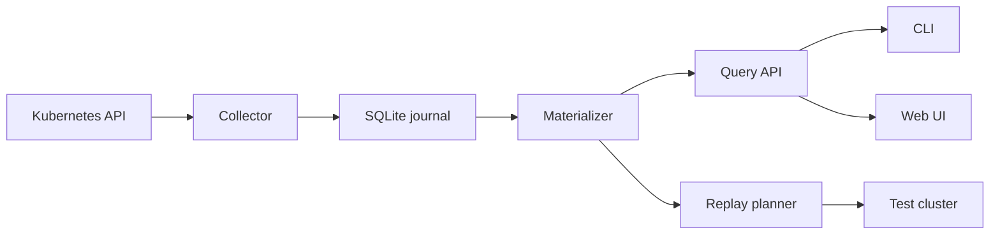
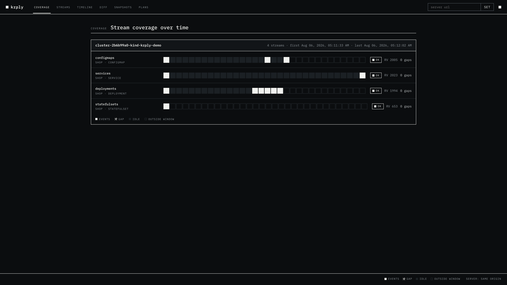
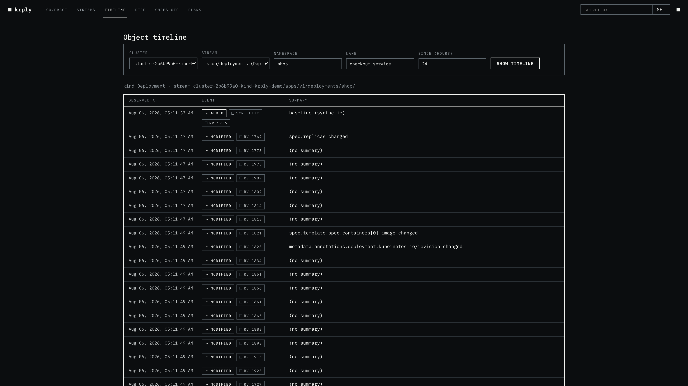
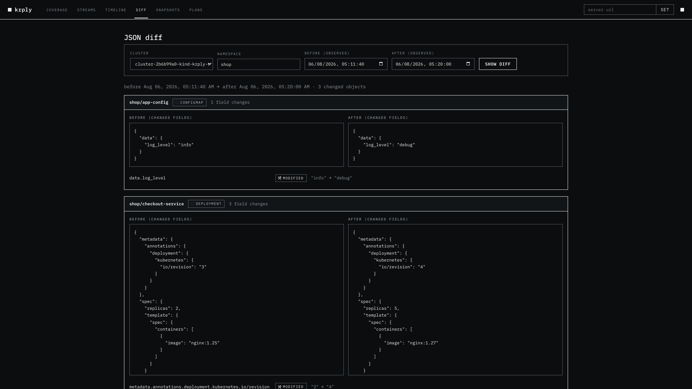
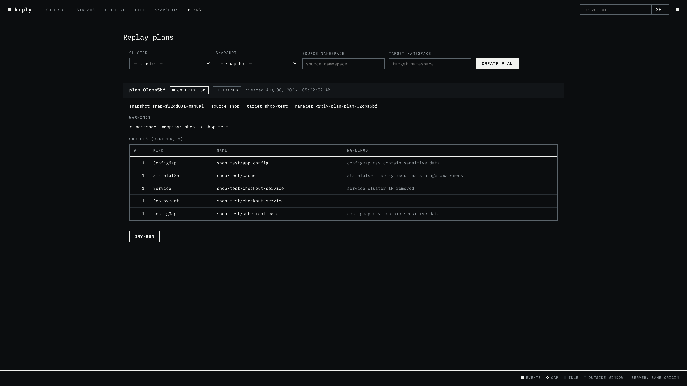

# krply

Gap-aware Kubernetes object history and replay planning.

krply records selected Kubernetes watch events in a local SQLite journal. It
shows timelines, field changes, coverage, snapshots, and safe replay plans.

## Features

- List and watch selected resources.
- Resume from durable resource versions.
- Record bookmarks as progress checkpoints.
- Mark 410 Gone responses as visible gaps.
- Reconstruct object state at a time.
- Compare state before and after a time.
- Build sanitized server-side apply plans.
- Review data through a CLI, HTTP API, or web UI.

## Architecture



The collector writes the raw event before it advances the checkpoint. A
reconnect can deliver an event again. The journal deduplicates that event.

## Requirements

- Go 1.26 or newer.
- kubectl and access to a Kubernetes cluster for recording.
- A kubeconfig with get, list, and watch access to selected resources.

## Install

```sh
make build
```

Binaries are written to `bin/krply` and `bin/krply-server`.

## Quick start

Record selected resources:

```sh
./bin/krply record \
  --kubeconfig ~/.kube/config \
  --context prod \
  --namespace shop \
  --resource deployments \
  --resource configmaps \
  --resource services \
  --store ./krply.db \
  --bookmarks
```

Inspect the journal:

```sh
./bin/krply status --store ./krply.db
./bin/krply coverage --store ./krply.db
./bin/krply timeline checkout-service --namespace shop --kind Deployment --store ./krply.db
./bin/krply diff --since 30m --until now --namespace shop --store ./krply.db
./bin/krply snapshot --store ./krply.db
```

Start the web UI and API:

```sh
./bin/krply-server --store ./krply.db --listen :8080
```

Open http://localhost:8080.

## Live demo

The following output came from a live kind cluster. The recording had four
streams and zero gaps.

```text
$ krply coverage --store /tmp/krply-live.db
STREAM                                                       RESOURCE           NAMESPACE  AVAIL  LAST-RV  GAPS  COVERAGE
cluster-2b6b99a0-kind-krply-demo//v1/configmaps/shop/        configmaps         shop       true   2005     0     OK
cluster-2b6b99a0-kind-krply-demo//v1/services/shop/          services           shop       true   2023     0     OK
cluster-2b6b99a0-kind-krply-demo/apps/v1/deployments/shop/   apps/deployments   shop       true   1994     0     OK
cluster-2b6b99a0-kind-krply-demo/apps/v1/statefulsets/shop/  apps/statefulsets  shop       true   653      0     OK
```

The real diff from that recording:

```text
$ krply diff --since 2026-08-05T23:41:40Z --until now --namespace shop --store /tmp/krply-live.db
CHANGED  3 objects
ConfigMap shop/app-config
    data.log_level  info -> debug
Deployment shop/checkout-service
    spec.replicas                                           2 -> 5
    spec.template.spec.containers[0].image                  nginx:1.25 -> nginx:1.27
Service shop/checkout-service
    metadata.labels.team  null -> payments
```

## Web UI









## Replay safety

`replay plan` is the normal entry point. It reconstructs state, checks
coverage, removes server-owned fields, maps namespaces, sorts resources, and
runs a server-side dry run.

It excludes Secrets, RBAC objects, Pods, Jobs, persistent storage, webhooks,
and CRDs by default. It never forces server-side apply conflicts. Apply
requires an explicit confirmation.

## Consistency

- Resource versions are comparable only within one cluster and API resource.
- Ordering is guaranteed only within one watch stream.
- `observed_at` is collector observation time, not object change time.
- A snapshot is complete only when every contributing stream has a baseline and
  no gap.
- Historical queries always return coverage information.

## Documentation

- [Architecture](docs/architecture/architecture.md)
- [Consistency model](docs/consistency/consistency.md)
- [Event schema](docs/event-schema/event-schema.md)
- [Replay safety](docs/replay-safety/replay-safety.md)
- [Threat model](docs/threat-model/threat-model.md)
- [Deployment manifests](deploy/)

## Development

```sh
make build
make test
make test-integration
make test-e2e
make web
```

The repository contains unit tests, a fake Kubernetes API server, and an
end-to-end recording pipeline. No real cluster is required for the tests.
