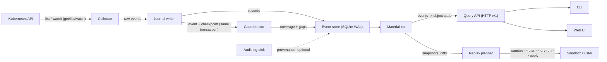
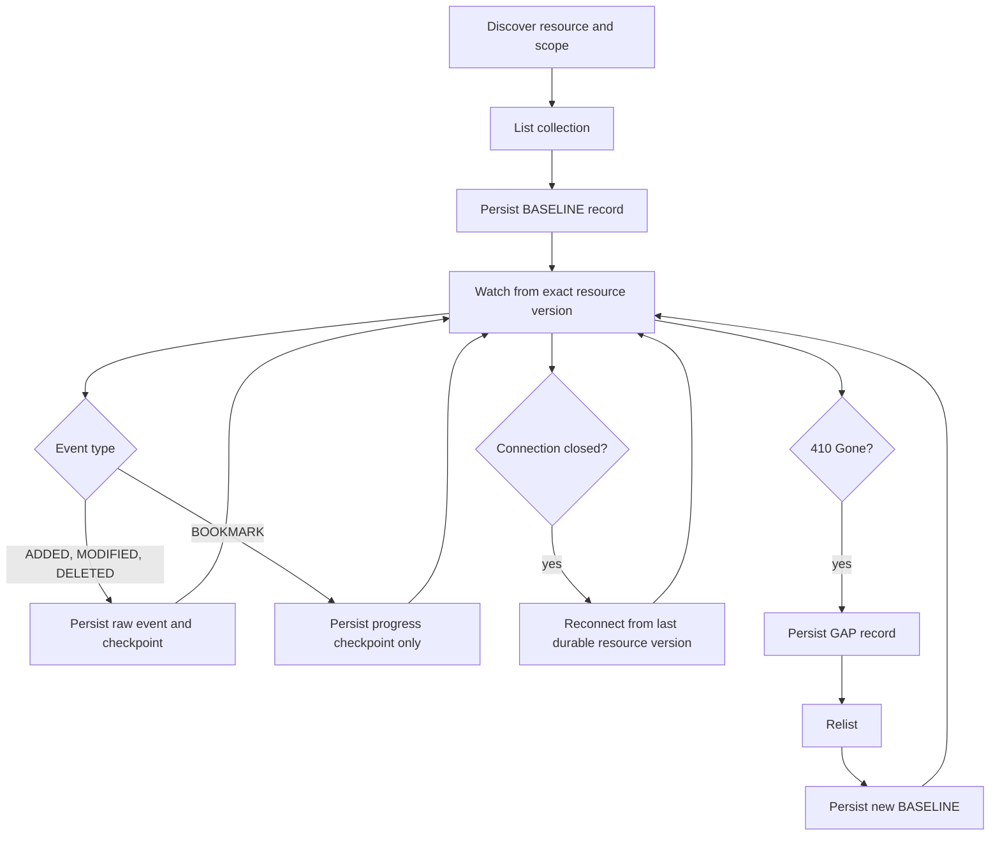

# Architecture

krply is a gap-aware Kubernetes object history and replay planner. It records watch events for a small, explicit allowlist of resources. It stores them in a durable local journal. It materializes object state on demand. It plans safe replays into a disposable cluster. See README.md for the product summary and product boundary.

## Component diagram

## Components

| Component | Role | Reads | Writes |
|---|---|---|---|
| Collector | Discovers resources, lists, watches, reconnects, relists | Kubernetes API | Journal |
| Journal writer | Persists raw events and checkpoints durably in one transaction | Collector | Event store |
| Gap detector | Marks continuity loss and coverage changes (GAP, COVERAGE_CHANGE) | Journal | Event store |
| Event store | Holds raw events, indexes, baselines, snapshots, coverage | Journal writer, gap detector | none |
| Materializer | Reduces events into object state; builds snapshots and diffs | Event store | SNAPSHOT records |
| Query API | Serves timelines, diffs, snapshots, and plans over HTTP | Event store, materializer | Replay plans |
| Replay planner | Sanitizes state and plans a safe apply into a sandbox | Event store, materializer | Plans, dry-run results |
| CLI and UI | Interfaces for investigation and replay review | Query API or local store | none |

## Collector lifecycle

For each stream the collector does the following steps. It discovers the resource and its scope. It lists the collection and records the collection resource version. It persists a BASELINE record. It watches from that exact resource version.

Then, per event:

- ADDED, MODIFIED, and DELETED persist the raw event and advance the checkpoint in the same transaction.
- BOOKMARK persists a progress checkpoint only. It never becomes an object change.
- A stream close reconnects from the last durable resource version.
- A 410 Gone response writes a GAP record, relists, writes a new BASELINE, and watches again.

A relist restores current state. It cannot reveal what changed during the gap. Every event in the initial list is marked synthetic. It is a baseline snapshot, not a creation event.

## Storage layout

The MVP store is SQLite in WAL mode. It has one writer and it works on one host only. Records and checkpoints are written atomically.

The planned object-storage segment layout for the central multi-cluster service is:

- cluster/date/resource/segment-0001.ndjson.zst
- cluster/date/resource/segment-0001.manifest.json

Each manifest records the event count, the sequence range, the per-stream resource versions, a checksum, the redaction policy version, and the schema version.

## API endpoints

Historical queries always return coverage and gap information. A partial result carries a warning.

| Method | Endpoint | Purpose |
|---|---|---|
| GET | /v1/clusters | List cluster identities |
| GET | /v1/streams | Show streams and coverage |
| GET | /v1/events | Query events with cursor pagination |
| GET | /v1/objects/{ref}/history | One object history |
| GET | /v1/diff | Compare two time boundaries |
| GET | /v1/snapshots | List materialized snapshots |
| POST | /v1/replay-plans | Create a sanitized plan |
| GET | /v1/replay-plans/{id} | Plan, warnings, dry-run result |
| POST | /v1/replay-runs | Apply an approved plan |
| GET | /v1/health | Service health |
| GET | /metrics | Prometheus metrics |

The API serves the web UI at the root path. CLI commands read the local store directly. The server flag switches them to the HTTP client.

## Multi-cluster

Each cluster gets an identity with an immutable generation. Resource versions and UIDs are never compared or merged across clusters. A local agent per cluster is preferred over a central service that holds credentials for every cluster.
