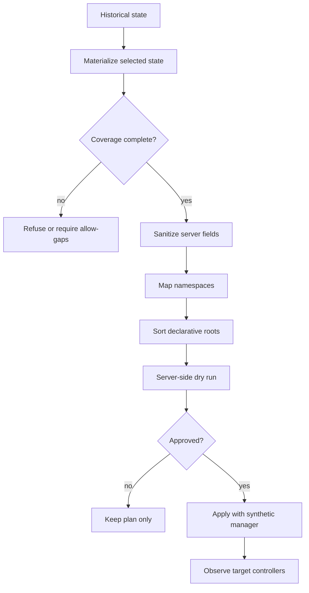

# Replay safety

Replay does NOT mean sending historical events back to a live cluster. krply reconstructs declarative state locally. It sanitizes the state. It plans an apply into a disposable target. It refuses to proceed without explicit approval. This document defines the replay safety rules.

## The 9-step flow

1. **Reconstruct**. Reconstruct the selected state locally from the journal.
2. **Verify stream completeness**. Every stream that feeds the plan must be complete with no unresolved gap.
3. **Remove server-generated fields**. Remove UIDs, resource versions, timestamps, managedFields, status, and other fields. The table below lists the defaults.
4. **Map namespaces and names**. Map source namespaces and names to target values. A source UID is never carried over.
5. **Sort resources by dependency**. Sort namespaces first, then declarative roots.
6. **Run a server-side dry run** with the synthetic field manager.
7. **Show the plan and warnings**. Include dry-run conflicts and errors.
8. **Apply only after explicit approval**. The replay apply command requires a successful dry run and a confirmation flag. A target namespace, when provided, is always honored.
9. **Observe the target without assuming convergence**. The tool does not prove that the target reached the intended state. Target controllers may still change it.

## Sanitization defaults

| Source field | Default action |
|---|---|
| metadata.uid | Remove |
| metadata.resourceVersion | Remove |
| metadata.creationTimestamp | Remove |
| metadata.generation | Remove |
| metadata.managedFields | Remove |
| metadata.deletionTimestamp | Remove |
| status | Remove |
| ownerReferences | Remove or remap (see below) |
| finalizers | Remove unless allowlisted |
| Service cluster IP fields | Reject or transform |
| Secret data | Exclude by default |
| RBAC objects | Exclude by default |

## Default exclusions

The planner excludes these kinds by default. The Policy object configures the exceptions:

- Secrets.
- ServiceAccounts and token objects.
- Roles, ClusterRoles, and bindings.
- Jobs and CronJobs.
- Pods.
- PersistentVolumes and claims.
- LoadBalancer Services.
- Storage resources.
- Admission webhooks.
- CRDs.

## MVP replay roots

Only these kinds can be replayed in the MVP:

- Namespaces.
- ConfigMaps, with sensitivity review. ConfigMaps can contain secrets.
- Safe Services.
- Deployments.
- StatefulSets, with warnings.
- DaemonSets.
- RuntimeClasses, plan-only.

## SSA rules (section 12)

- Use a synthetic field manager derived from the plan, for example krply-plan-<planID>. Never reuse the original manager name.
- No forced conflicts by default.
- Run a server-side dry run first.
- A conflict means the plan needs review. It is surfaced as a dry-run item, not silently resolved.
- The field managedFields is server-managed metadata. It is never copied into replay.

## Owner references (section 11)

- Owner references connect a dependent to an owner. They influence garbage collection. They are NOT evidence of who changed an object.
- A source UID is not valid in a target cluster.
- Replay declarative root objects. Let target controllers create ReplicaSets and Pods.
- Remove generated owner references by default.
- Treat finalizers as dangerous. Remove them unless approved.

## When a plan is refused

The planner refuses to produce or apply a plan in these cases:

- **Coverage is incomplete**. Any stream that feeds the plan has an unresolved gap, unless the Policy flag AllowGaps is set explicitly.
- **Dry run fails**. The server-side dry run reports conflicts, errors, or skipped objects, and Apply refuses unless the plan status is "dry-run-ok".
- **No explicit approval**. The apply command is missing the confirmation flag or a successful dry run. The target namespace, when given, is always honored, and objects are filtered to the source namespace first.
- **Excluded kinds requested**. A request to replay an excluded kind, such as Secrets, Pods, RBAC, PVs, webhooks, or CRDs, is refused unless the corresponding Policy allowlist flag is set.

## See also

- RBAC for recorder and replay identities: ../../deploy/rbac/.
- Threat model and the unsafe-replay control: ../threat-model/threat-model.md.
- Consistency requirements behind step 2: ../consistency/consistency.md.
