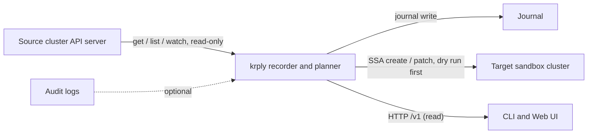

# Threat model

This document lists the threats that krply is designed against, the controls that mitigate them, the trust boundaries, and the RBAC model. The deployment RBAC manifests are in deploy/rbac/.

## Threats and controls

| Threat | Impact | Control | Where |
|---|---|---|---|
| Secret exposure | Credential leak | Exclude Secrets by default, redact ConfigMaps, encrypt the journal at rest if the host requires it | replay-safety, recorder RBAC |
| Unsafe replay | Production damage | Plan first, dry run, allowlist, explicit confirm flag, required target context, no write on source cluster | replay-safety |
| False claim of complete history | Wrong incident conclusions | Watermarks, gap markers, refusal on incomplete coverage | consistency |
| API server load | Control plane harm | Explicit allowlist, watch from exact RV, backpressure, profiles, benchmarks | architecture |
| SSA conflicts | Failed applies | Synthetic field manager, no force, dry run first | replay-safety |
| Invalid owner references | Orphaned objects | Remove or remap UIDs, replay roots only | replay-safety |
| Name collision | Community confusion | Rename or coordinate | none |

Each row of the risk table maps to at least one control above. The controls are structural. The journal format, the planner policy, and the RBAC manifests enforce them. They do not depend on operator discipline alone.

## Trust boundaries

Key boundaries:

- **Source cluster**. The recorder identity is read-only. It uses get, list, and watch. It has no write verbs and no Secrets access. See recorder RBAC below.
- **Journal**. The only write path is the journal writer. Any component that claims completeness must prove it from watermarks and gaps. It must never prove completeness from the absence of records.
- **Target cluster**. The replay identity has create and patch only. It is bound only in the sandbox. It cannot delete. It cannot read Secrets. It never runs against the source cluster.
- **Client boundary**. API reads go through the Query API. Historical queries always return coverage and gap information. A client cannot mistake a partial result for complete state.

## RBAC model (section 18)

The recorder identity is read-only with the minimum verbs:

- get
- list
- watch

Rules:

- Name specific API groups and resources. No wildcard groups, resources, or verbs.
- No Secret access by default.
- ConfigMaps and annotations can also contain sensitive material. Review them. This is why the ConfigMap comment in the RBAC manifests exists.
- Replay uses a separate identity with narrow write permissions. It has create and patch only, plus get and list for the dry run.
- No cluster-admin.
- No write access to the source cluster.

Reference manifests: ../../deploy/rbac/. The Helm chart ships a recorder ClusterRole bound to its own ServiceAccount. See ../../deploy/helm/krply/.

## What the tool does NOT claim

- It does not claim that Kubernetes provides immutable history. It stores its own journal and shows gaps.
- It does not guarantee a total order across resources. Ordering is per-stream.
- It does not recreate external side effects, such as PV contents, databases, or webhook callbacks. It replays declarative state only.
- It does not replace Kubernetes audit logging. Audit correlation is optional and works only when logs are available.
- It does not hide uncertainty behind a green status. Partial results carry warnings.
- It does not prove target convergence after apply. It observes without assuming.
- It is not a backup tool. It does not restore secrets or stateful data.

## See also

- Event payload and provenance: ../event-schema/event-schema.md.
- Consistency guarantees, meaning what a complete claim means: ../consistency/consistency.md.
- Replay safety flow: ../replay-safety/replay-safety.md.
- RBAC manifests: ../../deploy/rbac/.

[replay-safety]: ../replay-safety/replay-safety.md
[consistency]: ../consistency/consistency.md
